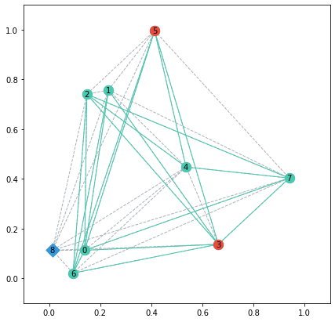

# 📦 Moving Firefighter Problem Generator

This package built on top of Networkx contains instances generators of the Moving Firefighter Problem (MFP) proposed by the Network and Data Science Laboratory CIC-IPN México.

- **Source:** <https://github.com/omargup/moving_firefighter_problem_generator>
- **Tutorial:** <https://github.com/omargup/moving_firefighter_problem_generator/blob/main/tutorial.ipynb>
- **YouTube:**
- **Papers:**

## Install

Movingfp requires Python 3.8 or greater. First, make sure you have the latest version of Numpy and Networkx. Install the current release of movingfp with pip:

```bash
pip install --upgrade numpy
pip install --upgrade networkx
pip install -e git+https://github.com/omargup/moving_firefighter_problem_generator#egg=movingfp
```

## Warning

At this moment only connected_erdos is available

## Simple example

Create an erdos instance and access its attributes.

```python
>>> import movingfp.gen as mfp

>>> x = mfp.erdos_connected(n=8, p=0.5, num_fires=2)

>>> x.A  # Adjacency matrix (Fire graph)
array([[0, 1, 1, 1, 0, 1, 1, 1],
       [1, 0, 0, 1, 0, 0, 1, 0],
       [1, 0, 0, 1, 1, 0, 1, 1],
       [1, 1, 1, 0, 0, 1, 1, 1],
       [0, 0, 1, 0, 0, 1, 0, 1],
       [1, 0, 0, 1, 1, 0, 1, 0],
       [1, 1, 1, 1, 0, 1, 0, 0],
       [1, 0, 1, 1, 1, 0, 0, 0]])

>>> x.D  # Distance matrix (Firefighter graph)
array([[0.00, 0.65, 0.63, 0.52, 0.52, 0.93, 0.10, 0.85, 0.13],
       [0.65, 0.00, 0.09, 0.76, 0.43, 0.30, 0.75, 0.79, 0.68],
       [0.63, 0.09, 0.00, 0.79, 0.49, 0.37, 0.72, 0.86, 0.64],
       [0.52, 0.76, 0.79, 0.00, 0.34, 0.90, 0.58, 0.38, 0.65],
       [0.52, 0.43, 0.49, 0.34, 0.00, 0.56, 0.62, 0.41, 0.62],
       [0.93, 0.30, 0.37, 0.90, 0.56, 0.00, 1.03, 0.79, 0.97],
       [0.10, 0.75, 0.72, 0.58, 0.62, 1.03, 0.00, 0.93, 0.12],
       [0.85, 0.79, 0.86, 0.38, 0.41, 0.79, 0.93, 0.00, 0.97],
       [0.13, 0.68, 0.64, 0.65, 0.62, 0.97, 0.12, 0.97, 0.00]])

>>> x.fighter_pos
[0.01227824739797545, 0.11239886108023578]

>>> x.node_pos
[[0.13869093321463077, 0.11244356285938728],
 [0.23180235707395025, 0.7575924853950116],
 [0.1474012209602784, 0.7406551989400061],
 [0.6621666555152632, 0.13657852434493012],
 [0.5356617475477887, 0.4477509299372836],
 [0.41257008317805066, 0.9963436915955056],
 [0.0931113892655685, 0.02036645837312856],
 [0.9398019156431335, 0.40294581161091647]]

>>> x.burnt_nodes
[3, 5]

>>> G_fire = x.G_fire  # networkx fire graph
<networkx.classes.graph.Graph at 0x7f8835947700>

>>> G_fighter = x.G_fighter  # networkx firefighter graph
<networkx.classes.graph.Graph at 0x7f8835947a00>
```

Draw the instance. Fire graph in green, firefighter graph in gray, initial burnt nodes in red, and firefighter in blue.

```python
>>> mfp.draw_mfp(x)
```



## Instaces

An instance of the Moving Firefighter Problem consists of two main parts: a fire graph and a firefighter graph.

- The fire graph `G_fire` represents the instance seen from the fire's point of view; this graph with $n$ nodes in $[0,1]^d$ and the edge weights set to $1$ is created following a particular procedure (depending on the generator).
- The firefighter graph `G_fighter` represents the instance seen from the firefighter's point of view; it has $n+1$ nodes: the same $n$ nodes of the fire graph and an extra node representing the firefighter. The firefighter graph is a complete graph with edge weights created or computed according to the generator.

Every MFP instance provides the following attributes:

- `A`. The $n \times n$ adjacency matrix of the fire graph.
- `D`. The $(n+1) \times (n+1)$ distance matrix of the firefighter graph where the last row and column are the firefighter distances to every node.
- `fighter_pos`. The $d$-dimensional firefighter position.
- `node_pos`. A $n \times d$ matrix with the node positions.
- `num_fires`. List with the indices of the initial burnt nodes.
- `G_fire`. Networkx fire graph.
- `G_fighter`. Networkx firefighter graph.

## Generators

MFP generators follow different strategies to create random instances. In all cases, by default, the initial position of the firefighter is selected at random in $[0,1]^d$; in the same way, once the number of initial fires is selected, their position is randomly set among all nodes.

Currently, these generators are available:

- Base generators
  - **Erdos:** Nodes of an Erdős-Rényi graph are placed randomly, with a uniform probability in $[0,1]^d$. Each of the possible edges is added with probability $p$. Euclidean distances are assigned to every edge in the firefighter graph.
  - **Geometric:** The $n$ nodes are uniformly sampled from the $[0,1]^d$space. Edges are included in the graph if the Euclidean distance is inferior o equal to a given radius r. Euclidean distances are assigned to every edge in the firefighter graph.
  - **No Metric Erdos:** An Erdos instance with random weights (distances) in a given interval assigned to each edge in the firefighter graph.
  - **REDS:** The $n$ nodes are placed randomly, with a uniform probability in the unit square $[0,1]^2$. The edges are generated following the Energy-Constrained Spatial Social Network Model proposed in <https://eprints.soton.ac.uk/364826/>. Euclidean distances are assigned to every edge in the firefighter graph.
- Spanning Trees generators
  - Erdos Spanning Tree
  - Geometric Spanning Tree
  - No Metric Erdos Spanning Tree
  - REDS Spanning Tree
- BFS Trees generators
  - Erdos BFS Tree
  - Geometric BFS Tree
  - No Metric Erdos BFS Tree
  - REDS BFS Tree

## To Do

## License
