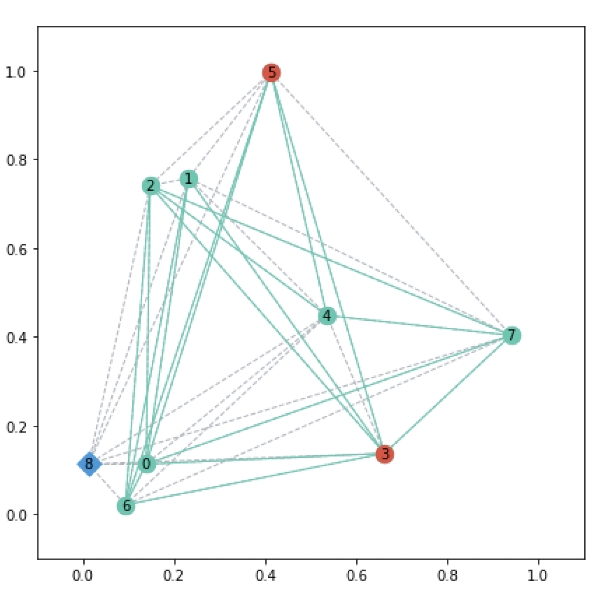

# 📦 Moving Firefighter Problem Generator

[](https://www.python.org/downloads/)
[](LICENSE)
[](https://doi.org/10.3390/math11010179)

This package, built on top of NetworkX, contains instance generators for the Moving Firefighter Problem (MFP), a variant of the classical Firefighter Problem. The MFP was proposed by the **Network and Data Science Laboratory at CIC-IPN, México**. In the MFP, a firefighter can move continuously through a metric space to defend nodes from a spreading fire.

- **Source:** <https://github.com/omargup/moving_firefighter_problem_generator>
- **Tutorial:** <https://github.com/omargup/moving_firefighter_problem_generator/blob/main/tutorial.ipynb>
- **Paper:** [Gutiérrez-De-La-Paz, B. R., García-Díaz, J., Menchaca-Méndez, R., Montenegro-Meza, M. A., Menchaca-Méndez, R., & Gutiérrez-De-La-Paz, O. A. (2023). The Moving Firefighter Problem. Mathematics, 11(1), 179.](https://doi.org/10.3390/math11010179)

## Table of Contents

- [📦 Moving Firefighter Problem Generator](#-moving-firefighter-problem-generator)
  - [Table of Contents](#table-of-contents)
  - [Problem Description](#problem-description)
  - [Installation](#installation)
  - [Usage](#usage)
    - [2D Example](#2d-example)
    - [3D Example](#3d-example)
  - [Instances](#instances)
  - [Generators](#generators)
    - [Available Generators](#available-generators)
    - [ToDo](#todo)
  - [Contributing](#contributing)
  - [License](#license)
  - [Citation](#citation)

## Problem Description

An instance of the Moving Firefighter Problem is defined by two graphs:

-   **Fire Graph (`G_fire`):** The fire graph represents the instance seen from the fire's point of view; this graph with $n$ nodes in $[0,1]^d$ and the edge weights set to $1$ is created following a particular procedure (depending on the generator).
-   **Firefighter Graph (`G_fighter`):** The firefighter graph represents the instance seen from the firefighter's point of view; it has $n+1$ nodes: the same $n$ nodes of the fire graph and an extra node representing the firefighter. The firefighter graph is a complete graph with edge weights created or computed according to the generator.

Initially, a set of nodes are burning. At each time step, the firefighter can travel between any two nodes in the firefighter graph. The travel time is determined by the distance between the nodes. When the firefighter arrives at a non-burning node, it becomes defended and can no longer burn. After the firefighter moves, the fire spreads from all burning nodes to their undefended neighbors in the fire graph. The process continues until the fire can no longer spread.

## Installation

`movingfp` requires Python 3.8 or greater.

1.  **Prerequisites:** Ensure you have the latest versions of `numpy`, `NetworkX`, and `plotly`.
    ```bash
    pip install --upgrade numpy networkx plotly
    ```

2.  **Install `movingfp`:
    ```bash
    pip install -e git+https://github.com/omargup/moving_firefighter_problem_generator#egg=movingfp
    ```

## Usage

### 2D Example

Create a 2D connected Erdos-Rényi instance and access its attributes:

```python
import movingfp.gen as mfp

# Generate a 2D instance
instance_2d = mfp.erdos_connected(n=8, p=0.5, num_fires=2)

# Access attributes
print("Adjacency Matrix (Fire Graph):")
print(instance_2d.A)

print("\nDistance Matrix (Firefighter Graph):")
print(instance_2d.D)

print("\nFirefighter Position:")
print(instance_2d.fighter_pos)

print("\nNode Positions:")
print(instance_2d.node_pos)

print("\nInitial Burnt Nodes:")
print(instance_2d.burnt_nodes)

# Get NetworkX graphs
G_fire = instance_2d.G_fire
G_fighter = instance_2d.G_fighter

# Plot the instance
mfp.plot2d(instance_2d)
```


*Fire graph in green, firefighter graph in gray, initial burnt nodes in red, and firefighter in blue.*

### 3D Example

Create a 3D connected Erdos-Rényi instance:

```python
import movingfp.gen as mfp

# Generate a 3D instance
instance_3d = mfp.erdos_connected(n=8, p=0.5, dim=3, num_fires=2)

# Plot the 3D instance
mfp.plot3d(instance_3d, node_size=10, plot_grid=True, plot_labels=True)
```


## Instances

Every MFP instance created by this package has the following attributes:

-   `A`: The $n \times n$ adjacency matrix of the fire graph.
-   `D`: The $(n+1) \times (n+1)$ distance matrix of the firefighter graph (the last row/column represents the firefighter's distances to the other nodes).
-   `fighter_pos`: The $d$-dimensional coordinates of the firefighter's initial position.
-   `node_pos`: An $n \times d$ matrix of node coordinates.
-   `burnt_nodes`: A list of initially burning nodes.
-   `G_fire`: The NetworkX fire graph.
-   `G_fighter`: The NetworkX firefighter graph.

## Generators

MFP generators create random instances. By default, the firefighter's initial position is selected at random while the initial fire locations are chosen uniformly at random among all nodes. For a detailed explanation of how each generator creates instances, please see the [documentation](docs/generators.md).

### Available Generators

-   **Erdos Connected:** Nodes of an Erdős-Rényi graph are placed uniformly at random in $[0,1]^d$ . Edges are added with probability $p$. To ensure connectivity, the generator creates a series of graphs until a connected component of size $n$ is found.

### ToDo

- **No Metric Erdos:** An Erdos instance with random weights (distances) in a given interval assigned to each edge in the firefighter graph.
- **REDS:** The $n$ nodes are placed randomly, with a uniform probability in the unit square $[0,1]^2$. The edges are generated following the Energy-Constrained Spatial Social Network Model proposed in <https://eprints.soton.ac.uk/364826/>. Euclidean distances are assigned to every edge in the firefighter graph.

## Contributing

Contributions are welcome! Please feel free to submit a pull request or open an issue.

## License

This project is licensed under the MIT License - see the [LICENSE](LICENSE) file for details.

## Citation

If you use this generator in your research, please cite the following paper:

```bibtex
@article{gutierrez2023moving,
  title={The Moving Firefighter Problem},
  author={Guti{\'e}rrez-De-La-Paz, B. R. and Garc{\'i}a-D{\'i}az, J. and Menchaca-M{\'e}ndez, R. and Montenegro-Meza, M. A. and Menchaca-M{\'e}ndez, R. and Guti{\'e}rrez-De-La-Paz, O. A.},
  journal={Mathematics},
  volume={11},
  number={1},
  pages={179},
  year={2023},
  publisher={MDPI}
}
```